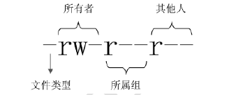

[[linux-command]]
= Linux 常用命令

[[linux-command-tip]]
== Linux 命令提示符

[source,shell]
----
[root@localhost ~]#
----

* `[]`:这是提示符的分割符号，没有特殊含义
* root:显示的是当前登录用户
* @: 分割符号，没有特殊含义
* localhost：当前系统的简写主机名
* ~:代表当前用户所在的目录
* `\#` : 命令提示符，`#` 是超级用户 `$` 是普通用户

[[linux-command-format]]
== Linux 命令基本格式

[source,shell]
----
[root@localhost ~]# 命令 [选项] [参数]
----

[[linux-command-directory]]
== 目录操作

[[linux-command-directory-ls]]
=== `ls` 命令

==== ls 命令基本信息

`ls` 是常见的目录操作命令，主要作用是显示目录下的内容

* 命令名称: ls
* 英文原意: list
* 所在路径: /bin/ls
* 执行权限: 所有用户
* 功能描述: 显示目录下的内容

[source,shell]
----
[root@localhost ~]# ls [选项] [文件名或目录名]
----

==== ls 命名选项

. `ls` 命名选项
|===
|选项 |描述

|-a
|显示所有文件

|--color=when
|支持颜色输出，when 的默认值是 `always` (总是显示)，也可以使 `never` (从不显示) 和 `auto` (自动)

|-d
|显示目录信息，而不是目录下的文件

|-h
|人性化显示，按照我的习惯的单位显示文件大小

|-i
|显示文件的 i 节点号

|-l
|长格式显示
|===

例如：使用 `ls -l` 内容如下

[source,shell]
----
[root@localhost ~]# ls -l
总用量 4
-rw-------. 1       root     root  1343 10月 22 14:48 anaconda-ks.cfg
# 权限       引用计数 所有者     所属组 大小  文件修改时间    文件名
----

. `-l` 参数列说明
|===
|列 |描述

| 1
| 权限，具体权限在 <<linux-command-permission>> 中说明

| 2
| 引用计数。文件的引用计数代表文件的硬链接个数，而目录的引用计数代表该目录有多少个一级子目录。

| 3
| 所有者，也就是这个文件属于哪个用户。默认所有者就是文件的创建者

| 4
| 所属组。默认所属组就是文件建立用户的有效组，一般情况下就是建立用户的所属组。

| 5
| 大小，默认是字节

| 6
| 文件修改时间，文件状态修改时间或者文件数据修改时间都会更改这个时间，注意这个时间不是文件创建的时间

| 7
| 文件名
|===

[[linux-command-directory-cd]]
=== `cd` 命令

`cd` 是切换所在目录的命令

* 命令名称: cd
* 英文原意: change directory
* 所在路径: Shell 内置命令
* 执行权限: 所有用户
* 功能描述: 切换所在目录

==== cd 命令的简化使用

|===
|特殊符号 |作用

| `~`
|代表用户的家目录

| `-`
|代表上次所在的目录

| `.`
|代表当前目录

| `..`
|代表上级目录
|===

[[linux-command-directory-pwd]]
=== `pwd` 命令

`pwd` 是是查询所在目录命令

* 命令名称: pwd
* 英文原意: print name of current/working directory
* 所在路径: /bin/pwd
* 执行权限: 所有用户
* 功能描述: 查询所在的工作目录

[[linux-command-directory-mkdir]]
=== `mkdir` 命令

`mkdir` 是是创建目录命令

* 命令名称: mkdir
* 英文原意: make directories
* 所在路径: /bin/mkdir
* 执行权限: 所有用户
* 功能描述: 创建空目录

`-p` 参数可以递归创建目录

[[linux-command-directory-rmdir]]
=== `rmdir` 命令

`rmdir` 是是删除目录命令

* 命令名称: rmdir
* 英文原意: remove empty directories
* 所在路径: /bin/rmdir
* 执行权限: 所有用户
* 功能描述: 删除空目录

`-p` : 递归删除目录

[NOTE]
====
rmdir 命令作用十分有限，因为只能删除空目录。所有一旦目录中有内容，就会报错。可以参考 <<linux-command-file-directory-rm>> 命令。
====

[[linux-command-file]]
== 文件操作

[[linux-command-file-touch]]
=== `touch` 命令

`touch` 创建空文件或修改文件时间

* 命令名称: touch
* 英文原意: change file timestamps
* 所在路径: /bin/touch
* 执行权限: 所有用户
* 功能描述: 修改文件的时间戳

[[linux-command-file-stat]]
=== `stat` 命令

`stat` 查看文件详细信息

* 命令名称: stat
* 英文原意: display file or file system status
* 所在路径: /usr/bin/stat
* 执行权限: 所有用户
* 功能描述: 显示文件或者文件系统的详细信息

[source,shell]
----
[root@localhost ~]# stat anaconda-ks.cfg
  文件："anaconda-ks.cfg"
  大小：1343      	块：8          IO 块：4096   普通文件
设备：fd00h/64768d	Inode：100663394   硬链接：1
权限：(0600/-rw-------)  Uid：(    0/    root)   Gid：(    0/    root)
环境：system_u:object_r:admin_home_t:s0
最近访问：2020-10-28 17:09:35.345425586 +0800
最近更改：2020-10-22 14:48:38.846449902 +0800
最近改动：2020-10-22 14:48:38.846449902 +0800
创建时间：-
----

[[linux-command-file-cat]]
=== `cat` 命令

`cat` 合并文件并打印输出到标准输出

* 命令名称: cat
* 英文原意: display file or file system status
* 所在路径: /bin/cat
* 执行权限: 所有用户
* 功能描述: 显示文件或者文件系统的详细信息

.`cat` 选项
|===
|参数 |说明

| -A
| 相当于 `-vET` 选项的整合，用于列出所有隐藏符号

| -E
| 列出每行结尾的回车符 `$`

| -n
| 显示行号

| -T
| 把 Tab 键用 `^I` 显示出来

| -v
| 列出特殊字符
|===

[[linux-command-file-more]]
=== `more` 命令

`more` 分屏显示文件内容

* 命令名称: more
* 英文原意: file perusal filter for crt viewin
* 所在路径: /bin/more
* 执行权限: 所有用户
* 功能描述: 分屏显示文件内容

`more` 命令比较简单，一般不用什么选项，命令会打开一个交互界面，可以识别一些交互命令：

* 空格键：向下翻页
* b： 向上翻页
* 回车键： 向下滚动一行
* /字符串：搜索指定的字符串
* q: 退出

[[linux-command-file-less]]
=== `less` 命令

`less` 和 `more` 命令非常相似，只是 more 是分屏显示命令，`less` 是分行显示命令。

* 命令名称: less
* 英文原意: opposite of more
* 所在路径: /usr/bin/less
* 执行权限: 所有用户
* 功能描述: 分行显示文件内容

[[linux-command-file-head]]
=== `head` 命令

`head` 显示文件开头。

* 命令名称: head
* 英文原意: output the first part of files
* 所在路径: /usr/bin/head
* 执行权限: 所有用户
* 功能描述: 显示文件开头的内容

.`head` 选项
|===
|参数 |说明

| -n 行数
| 从文件头开始，显示指定行数

| -v
| 显示文件名
|===

[[linux-command-file-tail]]
=== `tail` 命令

`tail` 显示文件结尾的命令。

* 命令名称: tail
* 英文原意: output the last part of files
* 所在路径: /usr/bin/tail
* 执行权限: 所有用户
* 功能描述: 显示文件结尾的内容

.`tail` 选项
|===
|参数 |说明

| -n 行数
| 从文件结尾开始，显示指定行数

| -f
| 监听文件的新增内容
|===

[[linux-command-file-ln]]
=== `ln` 命令

`ln` 在文件之间建立链接。

* 命令名称: ln
* 英文原意: make links between file
* 所在路径: /bin/ln
* 执行权限: 所有用户
* 功能描述: 在文件之间建立链接

[source,shell]
----
[root@localhost ~]# ln [选项] 源文件 目标文件
----

.`ln` 选项
|===
|参数 |说明

| -s
| 建立软链接文件。如果不加 `-s` 选项，默认建立硬链接

| -f
| 强制。如果目标文件已存在。则删除目标文件后再建立链接
|===

.软连接和硬链接的特征
****
硬链接特征：

* 源文件和硬链接文件拥有相同的 Inode 和 Block
* 修改任意一个文件，另一个都改变
* 删除任意一个文件，另一个都能用
* 硬链接标记不清，很难确认硬链接文件位置。不建议使用
* 硬链接不能链接目录
* 硬链接不能跨分区

软链接特征

* 源文件和软链接文件拥有不同的 Inode 和 Block
* 修改任意一个文件，另一个都改变
* 删除软链接，源文件不受影响。删除源文件，软链接不能使用
* 软链接没有实际数据，只能保存源文件的 Inode，不论源文件多大，软链接大小不变
* 软链接的权限是最大权限 `lrwxrwxrwx`,但是由于没有实际数据，最终访问时需要参考源文件权限
* 软链接可以链接目录
* 软链接可以跨分区
* 软链接特征明显，建议使用软链接
****

[[linux-command-file-directory]]
== 目录和文件

[[linux-command-file-directory-rm]]
=== `rm` 命令

`rm` 是强大的删除命令，不仅可以删除文件，也可以删除目录。

* 命令名称: rm
* 英文原意: remove files or directories
* 所在路径: /bin/rm
* 执行权限: 所有用户
* 功能描述: 删除文件或目录

.`rm` 选项
|===
|参数 |说明

| -f
| 强制删除

| -i
| 交互删除，在删除之前会询问用户

| -r
| 递归删除，可以删除目录
|===

[[linux-command-file-directory-cp]]
=== `cp` 命令

`cp` 是复制命令。

* 命令名称: cp
* 英文原意: copy files or directories
* 所在路径: /bin/cp
* 执行权限: 所有用户
* 功能描述: 复制文件或目录

.`cp` 选项
|===
|参数 |说明

| -a
| 相当于 `-dpr` 的集合

| -d
| 如果源文件为软链接（对硬链接无效），则复制出的目标文件也为软链接

| -i
| 询问，如果目标文件已经存在，会询问用户是否覆盖

| -p
| 复制后目标文件保留源文件的属性（包括所有者，所属组，权限和时间）。

| -r
| 递归复制，复制目录
|===

[[linux-command-file-directory-mv]]
=== `mv` 命令

`mv` 是剪贴命令。

* 命令名称: mv
* 英文原意: move(rename) files
* 所在路径: /bin/mv
* 执行权限: 所有用户
* 功能描述: 移动文件或改名

.`mv` 选项
|===
|参数 |说明

| -f
| 强制覆盖。如果目标文件已经存在，不再询问，直接覆盖。

| -i
| 交互移动，如果目标文件已经存在，则询问用户是否覆盖（默认选项）

| -v
| 显示详细信息
|===

[[linux-command-permission]]
== 基本权限管理

首先我们看下面这个示例：

[source,shell]
----
[root@localhost ~]# ls -l
总用量 4
-rw-------. 1 root root 1343 10月 22 14:48 anaconda-ks.cfg
----

首先第一列就代表了权限位，如果不计算最后的 `.` （`.` 在 <<perrmission.adoc#permission>> 中说明）。 则共有 `10` 位.这 10 位的含义为下

* 第一位代表文件类型：Linux 中不像 Windows 那样使用扩展名表示文件类型。而是使用权限位的第一位表示文件类型。详细情况可以使用 `info ls` 命令查看，下面是一些常见的文件类型。
+
|===
|标识符 |文件类型

| -
| 普通文件

| b
| 块设备文件，是一种特殊的设备文件，存储设备都是这种文件。如分区文件 /dev/sda1 就是这种文件

| c
| 字符设备文件，也是特殊文件，输入设备一般都是这种文件。如鼠标，键盘等。

| d
| 目录文件。Linux 中一切皆文件，所以目录也是文件的一种

| l
| 软链接文件

| p
| 管道符文件，这是一种非常少见的特殊设备文件

| s
| 套接字文件。这也是一种特殊设备文件，一些服务支撑 socket 访问，就会产生这样的文件
|===

* 2-4 位表示文件所有者权限
** -: 无权限
** r: 代表 read，是读取权限
** w: 代表 write，是写权限
** x: 代表 execute，代表执行权限
* 5-7 代表文件所属组的权限。同样拥有 `rwx` 权限
* 8-10 代表其他人权限，同样拥有 `rwx` 权限

[[linux-command-permission-chmod]]
=== 基本权限命令 (`chmod`)

`chmod` 是修改权限命令

* 命令名称: chmod
* 英文原意: change file mode bits
* 所在路径: /bin/chmod
* 执行权限: 所有用户
* 功能描述: 修改文件的权限模式

[source,shell]
. 命令格式
----
[root@localhost ~]# chmod [选项] 权限模式 文件名
----

-R : 递归设置模式

==== 权限模式

chmod 命令的权限模式的格式是 `[ugoa][[+-=][perms]]` 也就是  `[用户身份][[赋予方式][权限]]`

用户身份：

* u : 代表所有者(user)
* g : 代表所属组(group)
* o : 代表其他人(other)
* a : 代表全部身份(all)

赋予方式：

* + : 赋予权限
* - : 减去权限
* = : 设置权限

权限：

* r : 读取权限(read)
* w : 写权限(write)
* x : 执行权限(execute)

==== 数字权限

数字权限的赋予方式是最简单的，但不如字母的方式好记。

* 4 : 代表 `r` 权限
* 2 : 代表 `w` 权限
* 1 : 代表 `x` 权限

==== 常用权限

* 644 : 这是文件的基本权限。代表所有者拥有读写操作，而所属组和其他人只有读权限
* 755 : 这是文件的执行权限和目录的基本权限。代表所有者拥有读写和执行权限，而所属组和其他人拥有读和执行权限
* 777 : 这是最大权限

[[linux-command-permission-base]]
=== 基本权限作用

==== 权限含义解释

首先，读，写，执行权限对文件和目录的作用是不一样的。

权限对文件的作用

* 读(r) : 对文件有 读(r) 权限，代表可以读取文件中的数据。如果把权限对应到命令上，那么一旦对文件拥有 读(r) 权限，就可以对文件执行 `cat`,`more`,`less`,`head`,`tail` 等文件查看命令
* 写(w) : 对文件有 写(w) 权限，代表可以修改文件中的数据。如果把权限对应到命令上，那么一旦对文件拥有 写(w) 权限，就可以对文件执行 `vim`,`echo` 等修改文件的命令。**注意，对文件有写权限，是不能删除文件本身的，只能修改文件中的数据。如果要删除文件，则需要对文件的上级目录拥有写权限**
* 执行(x) : 对文件有 执行(x) 权限，代表文件拥有了执行权限。那么一旦对文件拥有 执行(x) 权限，这个文件就是执行文件了，至于到底能不能正确执行，还得看文件中的代码语法是不是正确。对文件来说，执行(x) 权限是最高权限。

权限对目录的作用

* 读(r) : 对目录有 读(r) 权限，代表可以查看目录下的内容。如果把权限对应到命令上，那么一旦对目录拥有 读(r) 权限，就可以对目录执行 `ls` 等命令
* 写(w) : 对目录有 写(w) 权限，代表可以修改目录下的内容。如果把权限对应到命令上，那么一旦对目录拥有 写(w) 权限，就可以对目录执行 `touch`,`mv`,`rm`,`cp` 等命令。**对目录来说，写(w)  权限是最高权限。**
* 执行(x) : 目录是不能运行的，那么对目录拥有 执行(x) 权限，代表可以进入目录。如果把权限对应到命令上，就可以对目录执行 `cd` 命令,进入目录。

目录的可用权限：

* 0 : 任何权限都不赋予
* 5 : 基本的目录浏览和进入权限
* 7 : 完全权限

[[linux-command-permission-chown]]
=== `chown` 命令

`chown` 是修改文件和目录的所有者和所属组命令

* 命令名称: chown
* 英文原意: change file owner and group
* 所在路径: /bin/chown
* 执行权限: 所有用户
* 功能描述: 修改文件和目录的所有者和所属组

[source,shell]
----
[root@localhost ~]# chown [选项] 所有者:所属组 文件或目录
----

-R : 递归设置权限

[[linux-command-permission-chgrp]]
=== `chgrp` 命令

`chgrp` 是修改文件和目录的所有组命令

* 命令名称: chgrp
* 英文原意: change group ownership
* 所在路径: /bin/chgrp
* 执行权限: 所有用户
* 功能描述: 修改文件和目录的所有组

[[linux-command-permission-umask]]
=== `umask` 命令

`umask` 是修改文件与目录的默认权限命令

* 命令名称: umask
* 英文原意: change group ownership
* 所在路径: /bin/umask
* 执行权限: 所有用户
* 功能描述: 文件与目录的默认权限

[source,shell]
----
[root@localhost bin]# umask
0022
# 用八进制数值显示 umask 权限
[root@localhost bin]# umask -S
u=rwx,g=rx,o=rx
# 用字母表示文件和目录的初始权限
----

==== umask 权限的计算方法

我们需要了解一下新建文件或目录的默认最大权限

* 对文件来讲，新建文件的默认最大权限是 `666` ，没有执行权限。这是因为执行权限对文件来讲比较危险，不能在新建权限的时候默认赋予。而必须手工赋予
* 对目录来讲，新建目录的默认最大权限是 `777` ，这是因为对目录而言，执行权限仅仅代表可以进入目录。所以即使建立新文件是直接默认赋予，也没有什么危险。

按照官方标准的算法，umask 默认权限需要使用二进制逻辑与和逻辑非联合运算才能得到正确的新建文件和目录的默认权限。这种方法即不好算，也不好立即。可以使用下面的方法

按照权限字母来计算。我们就按照默认的 `umask` 值是 022 来说

* 文件的默认最大权限为 `666`，而 umask 的值为 `022`，新建文件时：(-rw-rw-rw-) - (-----w--w-) ==> -rw-r--r--
* 目录的默认最大权限为 `777`，而 umask 的值为 `022`，新建目录时：(drwxrwxrwx) - (d----w--w-) ==> drwxr-xr-x

[[linux-command-help]]
== 帮助命令

[[linux-command-help-man]]
=== `man` 是最常见的帮助文档命令

`man` 是常见的目录操作命令

* 命令名称: man
* 英文原意: format and display the on-line manual pages
* 所在路径: /usr/bin/man
* 执行权限: 所有用户
* 功能描述: 显示联机帮助手册

. man 命令选项
|===
|参数 |说明

| -f
| 查看命令拥有那个级别的帮助

| -k
| 查看和命令相关的所有帮助
|===

. man 命令快捷键
|===
|快捷键 |作用

|上箭头
|向上移动一行

|下箭头
|向下移动一行

|PgDn
|向上翻页

|PgDown
|向下翻页

|g
|移动到第一页

|G
|移动到最后一页

|q
|退出

| /字符串
| 从当前页向下搜索字符串

| ?字符串
| 从当前一向上搜索字符串

| n
| 当搜素字符串时，可以使用 n 键找到下一个字符串

| N
|当搜素字符串时，可以使用 N 键反向查询字符串
|===

.`man` 命令的帮助级别
|===
|级别 |作用

| 1
| 普通用户可以执行的系统命令和可执行文件的帮助

| 2
| 内核可以调研的函数和工具的帮助

| 3
| C 语言函数的帮助

| 4
| 设备和特殊文件的帮助

| 5
| 配置文件的帮助

| 6
| 游戏的帮助

| 7
| 杂项的帮助

| 8
| 超级用户可以执行的系统命令的帮助

| 9
| 内核的帮助
|===

[[linux-command-help-info]]
=== `info` 命令

`info` 命令的帮助文档是一套完整的资料，每个单独命令的帮助文档只是这套完整资料的某一章小节

. info 命令快捷键
|===
|快捷键 |作用

|上箭头
|向上移动一行

|下箭头
|向下移动一行

|PgDn
|向上翻页

|PgDown
|向下翻页

|Tab
| 在带有 `*` 符合的节点间切换

|回车
|进入有 `*` 符号的子页面，查看详细的帮助文档

|u
|进入上一层信息(回车是进入下一层)

|n
|进入下一小节信息

|p
|进入上一小节信息

| ?
| 查看帮助信息

|q
|退出
|===

[[linux-command-help-help]]
=== `help` 命令

`help` 只能获取 shell 内置命令的帮助

* 命令名称: help
* 英文原意: help
* 所在路径: /bin/help
* 执行权限: 所有用户
* 功能描述: 获取 shell 内置命令的帮助

[[linux-command-help-help2]]
=== `--help` 选项

绝大多数命令都能使用 `--help` 选项获取帮助。

[[linux-command-search]]
== 搜索命令

[[linux-command-search-whereis]]
=== `whereis` 命令

`whereis` 是搜索系统命令的命令。也就是说 whereis 命令不能搜索普通文件。

* 命令名称: whereis
* 英文原意: locate the binary,source,and manual page files for a command
* 所在路径: /usr/bin/whereis
* 执行权限: 所有用户
* 功能描述: 查找二进制命令，源文件和帮助文档的命令

[source,shell]
----
whereis ls
# 查找文件(需要更新库:updatedb)
----

[[linux-command-search-which]]
=== `which` 命令

`which` 是搜索系统命令的命令。

* 命令名称: which
* 英文原意: show a full path of(shell) commands
* 所在路径: /usr/bin/which
* 执行权限: 所有用户
* 功能描述: 列出命令的所在路径

.which 和 whereis 的区别
****
whereis 命令可以在查找到二进制命令的同时，查找到帮助文档的位置

而 which 命令在查找到二进制命令的同时，如果这个命令有别名，则还可以找到别名命令。
****

[source,shell]
----
which ls
# 查找可执行的命令和帮助的位置:
----

[[linux-command-search-locate]]
=== `locate` 命令

`locate` 按照文件名进行搜索的命令

* 命令名称: locate
* 英文原意: list
* 所在路径: /usr/bin/locate
* 执行权限: 所有用户
* 功能描述: 按照文件名搜索文件

`locate` 按照数据库进行搜索，搜索速度快。数据库位于 `/var/lib/mlocate/mlocate.db`. 可以使用 `updatedb` 命令强制更新数据库。

只能按照文件名进行搜索，不能按照大小，权限，时间等搜索文件。

[NOTE]
====
centos7 默认是没有安装 `mlocate` 的，所以无法使用 `locate` 和 `updatedb` 这两个命令
====

配置文件：

[source,shell]
----
[root@localhost ~]# vi /etc/updatedb.conf
PRUNE_BIND_MOUNTS = "yes"
# 开启搜索限制，也就是让这个配置文件生效
PRUNEFS = "9p afs anon_inodefs auto autofs bdev binfmt_misc cgroup cifs coda configfs cpuset debugfs devpts ecryptfs exofs fuse fuse.sshfs fusectl gfs gfs2 gpfs hugetlbfs inotifyfs iso9660 jffs2 lustre mqueue ncpfs nfs nfs4 nfsd pipefs proc ramfs rootfs rpc_pipefs securityfs selinuxfs sfs sockfs sysfs tmpfs ubifs udf usbfs fuse.glusterfs ceph fuse.ceph"
# 在 locate 执行搜索时，禁止搜索这些文件系统类型
PRUNENAMES = ".git .hg .svn"
# 在 locate 执行搜索时，禁止搜索带有这些扩展名的文件
PRUNEPATHS = "/afs /media /mnt /net /sfs /tmp /udev /var/cache/ccache /var/lib/yum/yumdb /var/spool/cups /var/spool/squid /var/tmp /var/lib/ceph"
# 在 locate 执行搜索时，禁止搜索这些系统目录
----

[source,shell]
----
locate hello.txt
----

[[linux-command-search-find]]
=== `find` 命令

`find` 在目录中搜索文件

* 命令名称: find
* 英文原意: search for files in a directory hierarchy
* 所在路径: /bin/find
* 执行权限: 所有用户
* 功能描述: 在目录中搜索文件

[source,shell]
----
[root@localhost ~]# find 搜索路径 [选项] 搜索内容
----

.`find` 选项
|===
|参数 |说明 | 举例

| -name filename
| 按照文件名搜索
| find / -name passwd

| -iname
| 按照文件名搜索，不区分大小写
| find / -iname passwd

| -inum
| 按照 inode 号搜索
| find / -inum 2

| -size [+-]SIZE
| 安装指定大小搜索文件。`+` 代表搜索比指定的大小还要大的文件。`-` 代表搜索比指定大小还要小的文件。这个 `SIZE` 的规格有: `b`(这是默认单位，如果单位为 b 或者不写单位，则按照 512 Byte 搜索), `w`(按照双字节(中文)搜索), `c`(代表 byte),`k`(安装 kb 单位搜索，k 必须是小写),`M`(安装 MB 单位搜索，M 必须是大写),`G`(安装 GB 单位搜索，G 必须是大写)。
| find / -size +50k

| -atime [+-] n
| 按照文件访问时间搜索。`n` 为数字。`+n`  表示在 `n` 天之前(不含 n 天本身)的被更改过的文件名。`-n` 列出在 `n` 天之内(含 n 天本身) 被更改过的文件名。`n` 在 n 天之前的 "一天之内" 被更改过的文件。
| find / -atime 0

| -mtime  [+-] n
| 按照文件数据修改时间搜索
| find / -mtime 0

| -ctime  [+-] n
| 按照文件状态修改时间搜索
| find / -ctime 0

| -never file
| `file` 是一个已经存在的文件，列出比 `file` 还要新的文件名
| find /etc -never /etc/passwd

| -perm mode
| 查找文件权限刚好等于 "权限模式" 的文件
| find / -perm +7000

| -perm +mode
| 查找文件权限全部包含 "权限模式" 的文件
| find / -perm +7000

| -perm -mode
| 查找文件权限包含 "权限模式" 的任意一个权限的文件
| find / -perm +7000

| -uid 用户id
| 按照用户 id 查找所有者是指定 id 的文件
| find / -uid 10000

| -gid 组id
| 按照用户组 id 查找所属组是指定 id 的文件
| find / -gid 10000

| -user 用户名
| 按照用户名查找所有者是指定用户的文件
| find /usr -user hadoop -ls

| -group 组名
| 按照组名查找所属组是指定用户组的文件
| find /usr -group hadoop

| -nouser
| 查找没有所有者的文件
| find / -nouser

| -nogroup
| 查找没有所属组的文件
| find / -nogroup

| -type TYPE
| 查找文件类型为 `TYPE` 的文件。`TYPE` 类型主要有: `d`(目录),`f`(普通文件),`l`(软链接文件),`b,c`(设备文件),`s`(socket),`p`(FIFO).
| find /var -type s

| -a
| and 逻辑与
| find . -size +2k -a -type f

| -o
| or 逻辑或
| find . -name hello -o -name world

| -not
| not 逻辑非
| find . -not -name hello
|===

其他选项

[source,shell]
----
[root@localhost ~]# find 搜索路径 [选项] 搜索内容 -exec 命令2 {} \
----

`-exec` 这个选项的作用其实就是把 find 命令的结果交给由 `-exec` 调用的命令来处理。 `{}` 就代表 find 命令查找的结果.如下

[source,shell]
----
find / -name "hadooop*" -exec rm {} \;
----

`-ok` 选项和 `-exec` 选项的作用基本一致。区别在于，`-exec` 的命令2会直接处理。而不询问，`-ok` 的命令2 在处理前会先询问用户是否这样处理。在得到确认命令后，才会执行。

[source,shell]
----
find / -name "hadooop*" -ok rm {} \;
----

[[linux-command-search-grep]]
=== `grep` 命令

`grep` 的作用是在文件中提前和匹配符合条件的字符串行，命令格式如下

[source,shell]
----
[root@localhost ~]# grep [选项] "搜索内容" 文件名
----

.`grep` 选项
|===
|参数 |说明

| -i
| 忽略大小写

| -n
| 输出行号

| -v
| 反向查找

| --color=auto
| 搜索出的关键字用颜色显示
|===

.find 和 grep 的区别
****
find 命令用于搜索在系统中符合条件的文件名。如果需要模糊查询，则使用通配符匹配，通配符是完全匹配(find 命令可以通过 `-regex` 选项，把匹配规则转为正则表达式规则，但是不建议如此)。

grep 命令用于在文件中搜索符合条件的字符串，如果需要模糊查询，则使用正则表达式匹配，正则表达式是包含匹配。
****

.通配符和正则表达式的区别
****
通配符：用于匹配文件名，完全匹配

|===
|通配符 |作用

|?
|匹配一个任意字符

|*
|匹配 0 个或任意多个任意字符，也就是可以匹配任何内容

|[]
|匹配中括号中的任意一个字符。例如:[abc] 代表一定匹配一个字符，要么是a,要么是b,要么是c

|[-]
|匹配中括号中的任意一个字符，代表一个范围。例如 [a-z] 代表匹配一个小写字母

|[^]
|逻辑非，表示匹配不是中括号内的一个字符。例如: [^0-9] 代表匹配一个不是数字的字符
|===

正则表达式：用于匹配字符串，包含匹配

|===
|正则符 |作用

|?
|匹配前一个字符重复 0 次或者 1 次(`?` 是扩展正则，需要使用 `egrep` 命令)

|*
|匹配前一个字符重复 0 次或任意多次

|[]
|匹配中括号中的任意一个字符。例如:[abc] 代表一定匹配一个字符，要么是a,要么是b,要么是c

|[-]
|匹配中括号中的任意一个字符，代表一个范围。例如 [a-z] 代表匹配一个小写字母

|[^]
|逻辑非，表示匹配不是中括号内的一个字符。例如: [^0-9] 代表匹配一个不是数字的字符

|^
|匹配行首

|$
|匹配行尾
|===
****

[[linux-command-package]]
== 打包与压缩

[[linux-command-network]]
== 网络命令

[[linux-command-network-top]]
=== top

[[linux-command-network-netstat]]
=== netstat

[[linux-command-other]]
== 其他命令

[[linux-command-other-alias]]
=== `alias` 命令

命令的别名，也就是小名。主要是用于照顾管理员习惯用的。

.查询别名
[source,shell]
----
[root@localhost opt]# alias
alias cp='cp -i'
alias egrep='egrep --color=auto'
alias fgrep='fgrep --color=auto'
alias grep='grep --color=auto'
alias l.='ls -d .* --color=auto'
alias ll='ls -l --color=auto'
alias ls='ls --color=auto'
alias mv='mv -i'
alias rm='rm -i'
alias which='alias | /usr/bin/which --tty-only --read-alias --show-dot --show-tilde'
----

.定义别名
[source,shell]
----
[root@localhost opt]# alias 别名='原命令'
----

用命令定义的别名，是临时生效的，要想永久生效，需要写入环境变量配置文件 `~/.bashrc`

[[linux-command-constantly]]
== Linux 常用命令

[[linux-command-system]]
== Linux 系统命令

*  查看主机名

        hostname
*  修改主机名(重启后无效)

        hostname hadoop
*  修改主机名(重启后永久生效)

        vi /ect/sysconfig/network
*  修改IP(重启后无效)

        ifconfig eth0 192.168.12.22
*  修改IP(重启后永久生效)

        vi /etc/sysconfig/network-scripts/ifcfg-eth0
*  查看系统信息

        uname -a
        uname -r
*  查看ID命令
    
        id -u
        id -g

*  日期

        date
        date +%Y-%m-%d
        date +%T
        date +%Y-%m-%d" "%T
*  日历

        cal 2012
*  查看文件信息

        file filename
*  挂载硬盘

        mount
        umount
        加载windows共享
        mount -t cifs //192.168.1.100/tools /mnt
*  查看文件大小

        du -h
        du -ah
*  查看分区

        df -h
*  ssh

        ssh hadoop@192.168.1.1
*  关机

        shutdown -h now /init 0
        shutdown -r now /reboot

[[linux-command-user]]
== 用户和组

*  添加一个tom用户,设置它属于users组,并添加注释信息
        
        分步完成: useradd tom
                usermod -g users tom
	            usermod -c "hr tom" tom
        一步完成: useradd -g users -c "hr tom" tom

*  设置tom用户的密码

        passwd tom

        修改tom用户的登陆名为tomcat
        usermod -l tomcat tom
*  将tomcat添加到sys和root组中

        usermod -G sys,root tomcat

        查看tomcat的组信息
        groups tomcat
*  添加一个jerry用户并设置密码

        useradd jerry
        passwd jerry

*  添加一个交america的组

        groupadd america
*  将jerry添加到america组中
      
        usermod -g america jerry
*  将tomcat用户从root组和sys组删除

        gpasswd -d tomcat root
        gpasswd -d tomcat sys

*  将america组名修改为am

        groupmod -n am america

[[linux-command-permission]]
== 权限

*  创建a.txt和b.txt文件,将他们设为其拥有者和所在组可写入,但其他以外的人则不可写入:

        chmod ug+w,o-w a.txt b.txt
*  创建c.txt文件所有人都可以写和执行

        chmod a=wx c.txt 或chmod 666 c.txt
*  将/itcast目录下的所有文件与子目录皆设为任何人可读取

        chmod -R a+r /itcast

*  将/itcast目录下的所有文件与子目录的拥有者设为root,用户拥有组为users

        chown -R root:users /itcast
*  将当前目录下的所有文件与子目录的用户皆设为itcast,组设为users

        chown -R itcast:users *

[[linux-command-dir]]
== 文件夹属性

*  查看文件夹属性

        ls -ld test

*  文件夹的rwx

        --x:可以cd进去
        r-x:可以cd进去并ls
        -wx:可以cd进去并touch,rm自己的文件,并且可以vi其他用户的文件
        -wt:可以cd进去并touch,rm自己的文件

*  ls -ld /tmp

        drwxrwxrwt的权限值是1777(sticky)

[[linux-command-vim]]
== Vim

        i
        a/A
        o/O
        r + ?替换
        
        0:文件当前行的开头
        $:文件当前行的末尾
        G:文件的最后一行开头
        1 + G到第一行 
        9 + G到第九行 = :9
        
        dd:删除一行
        3dd: 删除3行
        yy:复制一行
        3yy:复制3行
        p:粘贴
        u:undo
        ctrl + r:redo
        
        "a剪切板a
        "b剪切板b
        
        "ap粘贴剪切板a的内容
        
        每次进入vi就有行号
        vi ~/.vimrc
        set nu
        
        :w a.txt另存为
        :w >> a.txt内容追加到a.txt
        
        :e!恢复到最初状态
        
        :1,$s/hadoop/root/g 将第一行到追后一行的hadoop替换为root
        :1,$s/hadoop/root/c 将第一行到追后一行的hadoop替换为root(有提示)

[[linux-command-zip]]
== 打包与压缩

*  gzip压缩
    
        gzip a.txt
*  解压

        gunzip a.txt.gz
        gzip -d a.txt.gz
*  bzip2压缩

        bzip2 a
*  解压
       
        bunzip2 a.bz2
        bzip2 -d a.bz2
*  将当前目录的文件打包

        tar -cvf bak.tar .
        将/etc/password追加文件到bak.tar中(r)
        tar -rvf bak.tar /etc/password
*  解压

        tar -xvf bak.tar
*  打包并压缩gzip

        tar -zcvf a.tar.gz
*  解压缩

        tar -zxvf a.tar.gz
        解压到/usr/下
        tar -zxvf a.tar.gz -C /usr
*  查看压缩包内容

        tar -ztvf a.tar.gz

        zip/unzip
*  打包并压缩成bz2

        tar -jcvf a.tar.bz2

*  解压bz2

        tar -jxvf a.tar.bz2

[[linux-command-pattern]]
== 正则表达式

*  cut截取以:分割保留第七段

        grep hadoop /etc/passwd | cut -d: -f7
*  排序

        du | sort -n 
*  查询不包含hadoop的

        grep -v hadoop /etc/passwd
*  正则表达包含hadoop

        grep 'hadoop' /etc/passwd
*  正则表达(点代表任意一个字符)

        grep 'h.*p' /etc/passwd
*  正则表达以hadoop开头

        grep '^hadoop' /etc/passwd
*  正则表达以hadoop结尾
        
        grep 'hadoop$' /etc/passwd
        
        规则:
        .  : 任意一个字符
        a* : 任意多个a(零个或多个a)
        a? : 零个或一个a
        a+ : 一个或多个a
        .* : 任意多个任意字符
        \. : 转义.
        \<h.*p\> : 以h开头,p结尾的一个单词
        o\{2\} : o重复两次
        
        grep '^i.\{18\}n$' /usr/share/dict/words
        
        查找不是以#开头的行
        grep -v '^#' a.txt | grep -v '^$' 
        
        以h或r开头的
        grep '^[hr]' /etc/passwd
        
        不是以h和r开头的
        grep '^[^hr]' /etc/passwd
        
        不是以h到r开头的
        grep '^[^h-r]' /etc/passwd

[[linux-command-grep]]
== 输入输出以及管道

*  新建一个文件

        touch a.txt
         b.txt
*  错误重定向:2>

        find /etc -name zhaoxing.txt 2> error.txt
*  将正确或错误的信息都输入到log.txt中

        find /etc -name passwd > /tmp/log.txt 2>&1 
        find /etc -name passwd &> /tmp/log.txt
*  追加>>

*  将小写转为大写(输入重定向)

        tr "a-z" "A-Z" < /etc/passwd
*  自动创建文件

        cat > log.txt << EXIT
        > ccc
        > ddd
        > EXI
*  查看/etc下的文件有多少个？

        ls -l /etc/ | grep '^d' | wc -l
*  查看/etc下的文件有多少个,并将文件详情输入到result.txt中

        ls -l /etc/ | grep '^d' | tee result.txt | wc -l

[[linux-command-process]]
== 输入输出以及管道

*  查看用户最近登录情况

        last
        lastlog
*  查看硬盘使用情况
        
        df
*  查看文件大小
        
        du
*  查看内存使用情况
        
        free
*  查看文件系统
        
        /proc
*  查看日志
        
        ls /var/log/
*  查看系统报错日志
        
        tail /var/log/messages
*  查看进程
        
        top
*  结束进程

        kill 1234
        kill -9 4333